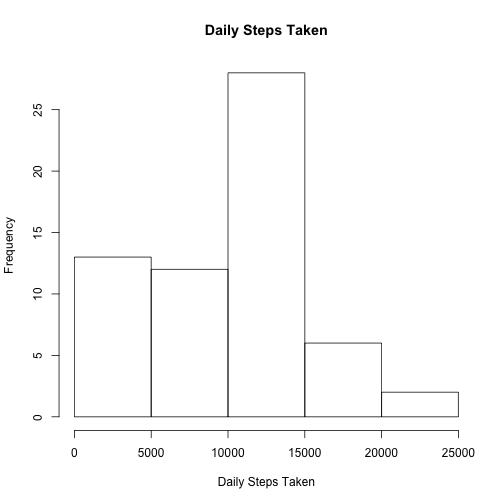

## Loading and preprocessing the data

Data is loaded into a data frame from a CSV file.


```r
library(plyr)
library(lubridate)
library(lattice)

data <- read.csv("activity.csv",na.strings="NA")
data$date <- ymd(data$date)
```


## What is mean total number of steps taken per day?

The following is a histogram of the daily steps taken.


```r
dailySteps <- ddply(data,.(date),summarize,stepsTaken = sum(steps,na.rm=TRUE))

hist(dailySteps$stepsTaken,xlab='Daily Steps Taken',main='Daily Steps Taken')
```

 


```r
meanDailySteps <- mean(dailySteps$stepsTaken)
medianDailySteps <- median(dailySteps$stepsTaken)
```

The mean number of steps taken daily is 9354.2295082 and the median is 10395.

## What is the average daily activity pattern?

The following is a plot of the daily activity pattern averaged across all the days in the data set.


```r
dailyActivityPattern <- ddply(data,.(interval),summarize,meanStepsTaken = mean(steps,na.rm=TRUE))

plot(dailyActivityPattern$interval,dailyActivityPattern$meanStepsTaken,type='l',xlab='Interval',ylab='Average Steps Taken',main='Daily Activity pattern')
```

 


```r
maxStepsInterval <- dailyActivityPattern[which.max(dailyActivityPattern$meanStepsTaken),1]
```

On average, the interval in which the most steps were taken is 835.

## Imputing missing values


```r
missingValCount <- sum(is.na(data$steps))
```

There are 2304 missing values for steps taken in the data set.

Missing 'steps' values were estimated by taking the average of all non-NA steps data, as follows.


```r
replaceNA <- function(s) {
  if(is.na(s)) {
    s <- mean(data$steps,na.rm=TRUE)
    # s <- dailyActivityPattern[which(dailyActivityPattern$interval==i),2][1]
  }
  s
}

estData <- data
estData$estSteps <- sapply(data$steps,replaceNA)
```

The following is a histogram of the daily steps taken using the estimated steps data.


```r
estDailySteps <- ddply(estData,.(date),summarize,stepsTaken = sum(estSteps,na.rm=TRUE))

hist(estDailySteps$stepsTaken,xlab='Daily Steps Taken',main='Daily Steps Taken Based on Estimated Data')
```

 


```r
estMeanDailySteps <- mean(estDailySteps$stepsTaken)
estMedianDailySteps <- median(estDailySteps$stepsTaken)
```

Based on the estimated steps data, the mean number of steps taken daily is 1.0766189 &times; 10<sup>4</sup> and the median is 1.0766189 &times; 10<sup>4</sup>. The mean and median values are not much different, but the estimated data creates a steeper histogram than was made with the NA values omitted.


## Are there differences in activity patterns between weekdays and weekends?

The following pair of plots show the average activity pattern for weekdays and for weekends. Weekends appear to have fewer steps overall, with the peak activity later in the day compared to weekdays.


```r
weekends <- c('Saturday','Sunday')

data$isWeekend <- factor((weekdays(data$date) %in% weekends), levels=c(TRUE,FALSE), labels=c('weekend', 'weekday'))

xyplot(steps ~ interval|isWeekend, data=data, layout=c(1,2), type="l")
```

 
